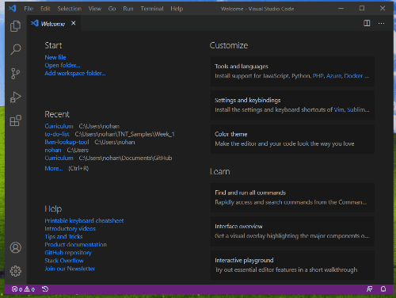
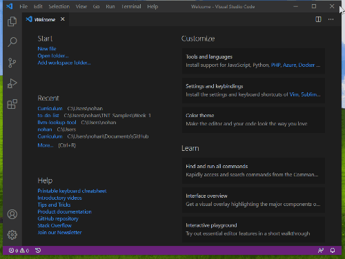
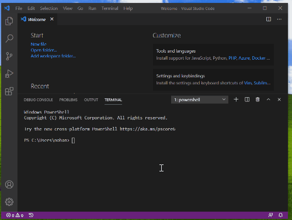

# Setup Checklist

## Create web app

1. [Install VS Code](https://code.visualstudio.com/)
2. [Install node.js and node package manager](https://nodejs.org/en/download/)
3. [Install yarn](https://legacy.yarnpkg.com/en/)
4. [Install create-react-app](https://create-react-app.dev/docs/adding-typescript/)
    * Open Visual Studio Code (VS Code).
    * From the top command bar, open the file menu "Terminal". Select "New Terminal".
    * In the terminal, enter the command `npm install -g create-react-app`.

    

Test setup:

1. Create a new TypeScript project
    * Open VS Code.
    * From the top command bar, open the file menu "Terminal". Select "New Terminal".
    * In the terminal, enter the command `yarn create react-app test-app --template typescript`

    
2.  Open the project and see what's there
    * From the terminal change directory (CD), move to the folder, of the test app with the command `cd test-app`.
    * The current working directory, folder, is now in the folder where the app files live. Use the command `code .` to open the folder in the new VS Code window.

    

## Version control

1. [Install Git](https://git-scm.com/downloads)
2. Create an [Atlassian account](https://id.atlassian.com/signup?application=mac&continue=https%3A%2F%2Fmy.atlassian.com%2Fproducts%2Findex&_ga=2.194280489.527942488.1580229548-1763893018.1578596454), consumer identity
3. [Install Sourcetree](https://www.sourcetreeapp.com/)
4. Create a [GitHub account](http://github.com/join) if you don't already have one

Test setup:

* [Create a local Git repository](https://git-scm.com/book/en/v2/Git-Basics-Getting-a-Git-Repository) 
* [Add local repository to Sourcetree](https://confluence.atlassian.com/get-started-with-sourcetree/add-an-existing-local-repository-847359105.html)
* [Create a repo on GitHub and clone with command line](https://help.github.com/en/github/creating-cloning-and-archiving-repositories/cloning-a-repository)
