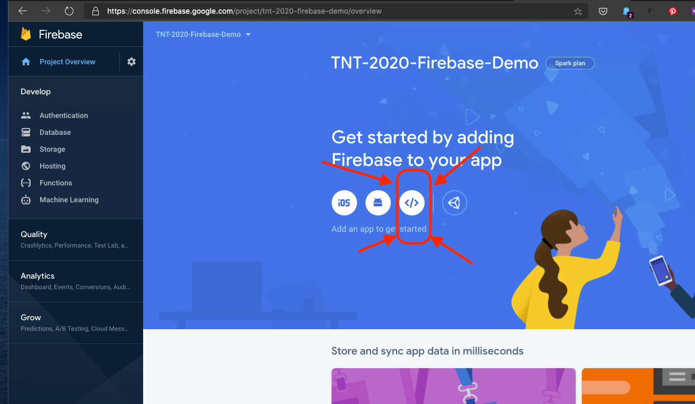
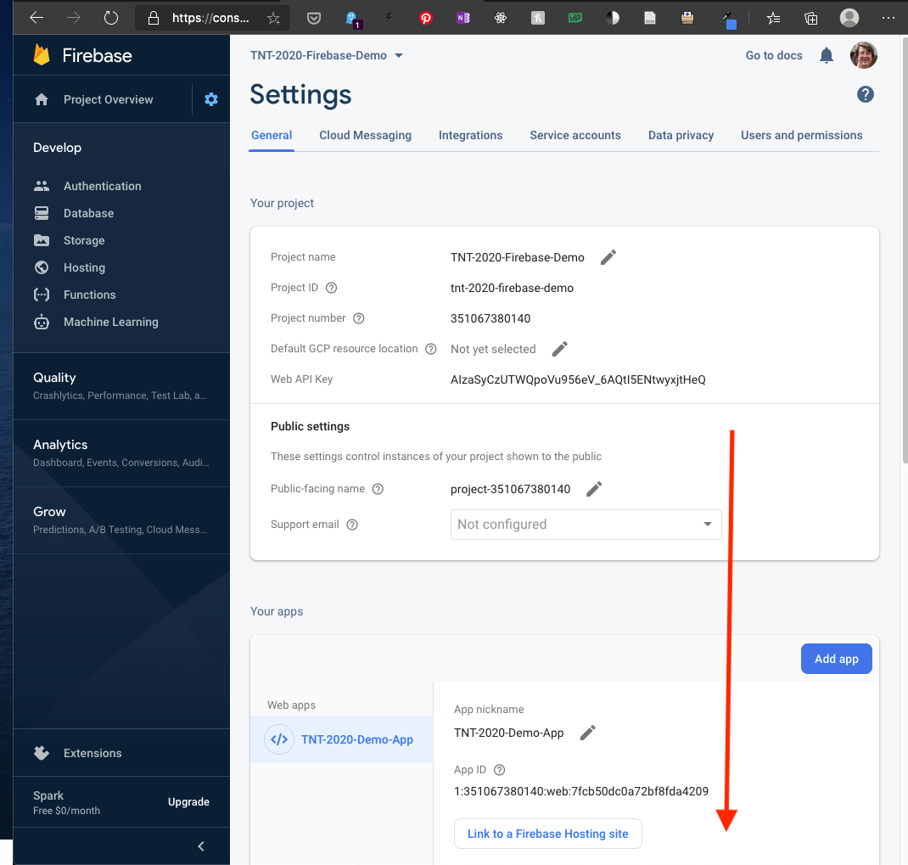

# Using Firebase In A React App


Much of what I've got here was [simplified from this blog post](https://www.robinwieruch.de/complete-firebase-authentication-react-tutorial#react-application-setup-create-react-app) - this post was terrible.  There's too many concepts thrown in and the author is very, very verbose (both in terms of their writing and their code - they routinely have separate files with like a couple lines of actual code)

## Steps

1. Let's look at what a JSON 'database' is by looking at Firebase
   1. Let's look at Firebase
   2. Let's look at JSON
2. What should you put in a DB?
3. How does the code work out?
   1. The listener / promise thing - we're going to try and ignore it :)
   2. Basic API


### Steps:

1. [Sign up for Firebase on their website.](https://firebase.google.com/)
   (It's free)
   
2. Set up a Firebase project
   [Step-by-step guide](https://www.robinwieruch.de/firebase-tutorial)
   
   - Pick a name
   - Say 'No' to Google Analytics
   
3. Click on the 'web app' info:
   
   
   - Give it a name but do NOT host your solution on Firebase
   
4. The tutorial that I found recommends the class [Realtime Database](https://www.robinwieruch.de/firebase-tutorial#firebase-database) but it appears that the newer 'Cloud Firestore' is free, too
   - We'll start in test mode - this means that anyone, anywhere, who has a reference (link) to the DB can change it
   - MVP for the win!
   
5. Install the FB stuff:
   `npm install firebase`
   Note: you do NOT need `npm install @types/firebase` - the base package includes type defs
   
6. Copy this into a new file (named, say, `firebase.tsx`) in your project:

   ```typescript
   const config = {
       apiKey: YOUR_API_KEY,
       authDomain: YOUR_AUTH_DOMAIN,
       databaseURL: YOUR_DATABASE_URL,
       projectId: YOUR_PROJECT_ID,
       storageBucket: '',
       messagingSenderId: YOUR_MESSAGING_SENDER_ID,
   };
   ```

   - Most of this can by copy and pasted from the Firebase config page:
     Config info is in the 'General' tab of system config:
     
   -  Note: Checking all this info into GitHub isn't particularly secure.
     There are ways to store this information in other files (for example, .env files, which are loaded into environment variables); you can then store those files outside of source control

7. Next, plug these into the `Firebase.tsx` file:
   (Note the <> after createContext!!!)

   ```typescript
   export class Firebase {
       constructor() {
           app.initializeApp(firebaseConfig);
       }
   }
   
   export const FirebaseContext = React.createContext<Firebase | null>(null);
   ```

8. In index.tsx make sure that you import these

   ```typescript
   import { Firebase, FirebaseContext } from './firebase';
   ```

9. Update ReactDOM.render like so:

   ```typescript
   ReactDOM.render(
     <FirebaseContext.Provider value={new Firebase()}>
       <App />
     </FirebaseContext.Provider>,
     document.getElementById('root'),
   );
   ```

10. 

[Useful tutorial on React Context](https://www.robinwieruch.de/react-context)

[Typescript and React Context](https://www.carlrippon.com/react-context-with-typescript-p1/)