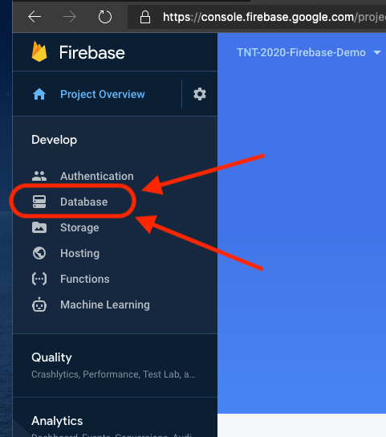
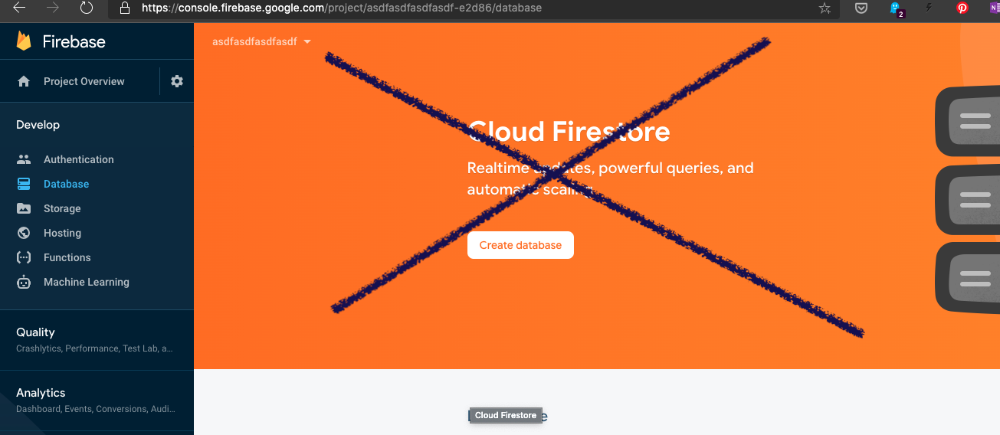
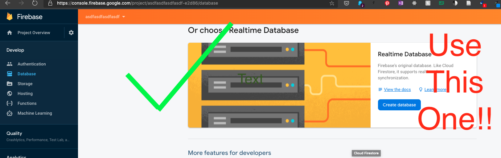
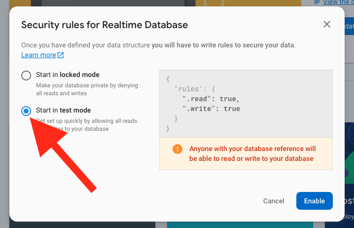
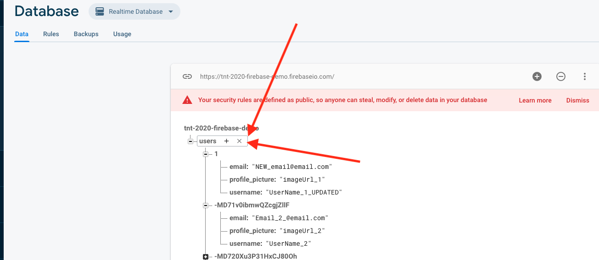
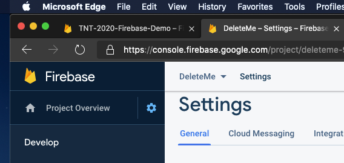
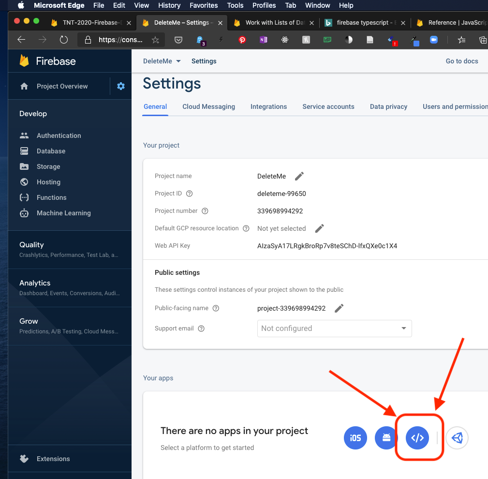
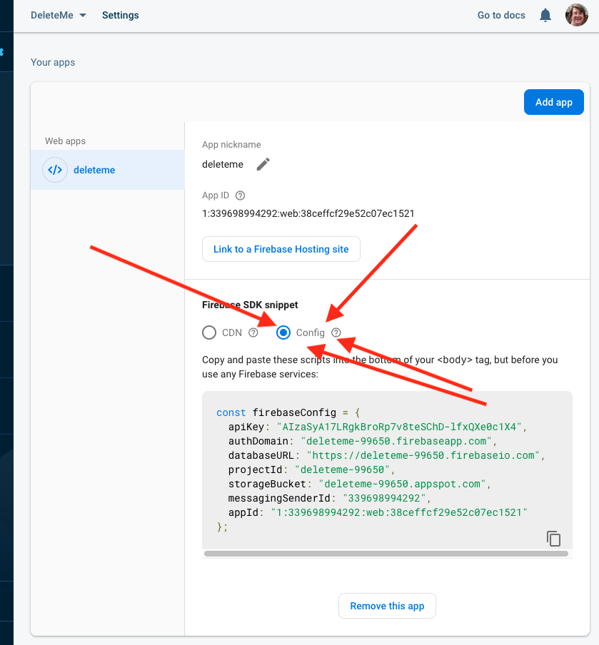

# Using Firebase In A React App


## Learning objectives

* TNTs will understand what a document-oriented database is (e.g., Cosmos DB, MongoDB, Firebase)
* TNTs will be able to create a new 'app' in Firebase
* TNTs will be able to create, read, update, and delete information in their Firebase database using the Firebase website
* TNTs will be able to access their Firebase database programmatically, including the normal CRUD operations

## Instructional session (60 minutes)

### Lesson Overview

1. Let's look at what a JSON 'database' is by looking at Firebase
   1. Let's look at Firebase
   2. Let's look at what JSON is
2. What *should* you put in a DB?
3. How do we access the database from code?
   1. How to get your app's database configuration info
   2. Setting up your app
   3. Overview of our approach to using Firebase
   4. CRUD operations: Create
   5. CRUD operations: Read
   6. CRUD operations: Update
   7. CRUD operations: Delete

### Let's look at Firebase:

1. [Sign up for Firebase on their website.](https://firebase.google.com/)
   (It's free)
   
2. Set up a Firebase project
   [Step-by-step guide](https://www.robinwieruch.de/firebase-tutorial)
   
   - Pick a name
   - Say 'No' to Google Analytics :)
   
3. Next, the left-hand column open up the 'Develop' tab and click on 'Database':
   
   
4. Next, you'll need to create a new database.  
   We're going to use the "Realtime Database", NOT Cloud Firestore:
   


   

5. For now let's use "test mode", since it will be easier to connect to.  (You can change this later on if you'd like)
   

6. Your database will start out empty, if you move the mouse over an element you'll be given the option to add sub-items or to remove the item:
   

### Exercise:

Try to re-create the picture above.  Instead of using the values "MD71v0ibmwQZcgjZllF" and "MD720Xu3P31HxCJ80Oh" feel free to use something that's easier to type, such as "2" and "3"

### Let's look at what JSON is

There's a [rather lengthy article in Wikipedia about JSON which includes a lot of solid examples to browse through](https://en.wikipedia.org/wiki/JSON).  
The 'tree view' of the document (in our document database) is a typical example of how to think about JSON files.  

There's a couple of important points to remember when working with JSON files:

1. JSON files are very similar to object literals in JavaScript (and therefore similar-ish to object literals in TypeScript) but there are differences.  For example, and object literal in JS/TS does not need to put quotes around the field names...

   ```typescript
   let objectLiteral = {
     name: "A",
     email: "A@A.com"
   }
   ```

   ...but JSON files do need the quotes::

   ```json
   {
     "name": "A",
     "email": "A@A.com"
   }
   ```

2. There's no rules enforcing a certain structure, nor limiting what you can do with this.

   - On the one hand this is nice because you can add extra information or fields to any given part of the document, which can be handy (especially in web application development, because the browser will send the server a bunch of strings and these strings may or may not be consistent each time).
   - On the other hand computers are best at doing the exact same thing over and over, so when you've got a document that may have variations in the structure that may complicate your code

3. You CANNOT have circular references in the document

   - There are ways around this.  For example, instead of a reference you could put in an ID number, and then put stuff into the document in way that allows you to look up objects by ID number.

4. You CANNOT put comments into JSON files (at least officially)
   Because this was intended as a format for one program to send information to another program there's no way to add comments.  :(

### What *should* you put in a DB?

# NOT DONE YET

Let's talk briefly about what to put in here

For AppPrototype, maybe just put all of this.state into it?

Normally you'd only store data that you want to persist across runs of your program

### How do we access the database from code?

#### How to get your app's database configuration info

1. We'll need to create an 'app' before we can have our program use the database.  There are multiple ways to find this, but we'll start by clicking on the Project Overview link in the top-left:
   

2. Notice that there's an option for iOS and another for Android - we'll use the web application option:
   

3. When Firebase asks make sure that you do give it a name but do NOT host your solution on Firebase

4. Once you've done that it'll show you a Wall of Code.  Copy it and paste it into a new file (just so you don't lose it on the clipboard)

   - If you need this again you can find it in your Project Overview > Project Settings page:
     

   - On the 'General' tab (which opens by default) scroll down to the 'Your Apps' section, and you'll find that same info (clicking on the 'Config' button will even give you usable JavaScript/TypeScript):

     

#### Setting up your app

1. The next step is to actually set up the code that will connect to the database.

   The approach we're going to use is to create a class that all your components can use.  This way we can centralize repetitive logic in a single place.

2. Let's start this by opening at your app in VSCode (or by opening [the sample project in the Samples repo](https://github.com/tnt-summer-academy/Samples/tree/main/Stretch/firebase))

3. You can install the Firebase support in your terminal like this:
   `npm install firebase`

   - Note: you do NOT need `npm install @types/firebase` - the firebase package includes type defitions for TypeScript (I believe the Firebase JavaScript API itself is written in TypeScript)

4. Copy this into a new file (named, say, `myFirebase.tsx`) in your project:

   ```typescript
   import firebaseApp from 'firebase/app'
   import firebase from 'firebase'
   
   const firebaseConfig = {
       apiKey: "AIzaSyCzUTWQpoVu956eV_6AQtI5ENtwyxjt",   // REPLACE THIS WITH YOUR INFO!!!
       authDomain: "tnt-2020-fireb-demo.firebaseapp.com",  // REPLACE THIS WITH YOUR INFO!!!
       databaseURL: "https://tnt-2020-fireb-demo.firebaseio.com",  // REPLACE THIS WITH YOUR INFO!!!
       projectId: "tnt-2020-fibase-demo",  // REPLACE THIS WITH YOUR INFO!!!
       storageBucket: "tnt-2020-frebas-demo.appspot.com",  // REPLACE THIS WITH YOUR INFO!!!
       messagingSenderId: "3510673140",  // REPLACE THIS WITH YOUR INFO!!!
       appId: "1:351067380140:web:7fcb50dc0a72bf84209"  // REPLACE THIS WITH YOUR INFO!!!
   };
   
   
   export class MyFirebase {
       constructor() {
           if (firebase.apps.length === 0) {
               firebaseApp.initializeApp(firebaseConfig);
           }
       }
   }
   ```

   - Note: Checking all this info into GitHub isn't particularly secure.
     There are ways to store this information in other files (for example, .env files, which are loaded into environment variables); you can then store those files outside of source control

   - Firebase wants us to initialize the connection to the database, but it wants us to do that *exactly once* in the program.  We can make this easy by putting the following code into the constructor:

     ```typescript
     if (firebase.apps.length === 0) {
     		firebaseApp.initializeApp(firebaseConfig);
     }
     ```

     If we've initialized our app already then the firebaseApp.apps array will have an entry in it, so it's length / size will be greater than zero.  If we have NOT initialized the app then that array will be empty, and have a length of 0.
     Here in TypeScript/JavaScript we ask if the array is empty (if it has a length of zero) and if so then we call the initializeApp() method with the configuration information that we copied from the Firebase website.

5. Then, inside any other file that you want to use Firebase in you'll need to put this at the top of the file:

   ```typescript
   import { MyFirebase } from './myFirebase';
   ```

   After that you'll need to create the database in each method / function that you want to use it in, like so:

   ```typescript
     let db = new MyFirebase();
     // After this you can then call methods on your 'MyFirebase' object
   ```

#### Overview of our approach to using Firebase

We've already got a class that will connect to Firebase for us.  We're going to add a method to that class for each action you want to do on the DB.  Each time you ask (query) for information, or add / update / remove information, etc - each action gets their own method.   
This way you can then say something like "`db.addUser(firstname, lastname, etc, etc);`" in the rest of your app, and this one class is the only thing that needs to worry about how to interact with the database.

In each case we're going to follow the same general set of steps, whether it's adding information to our database or reading a list out.  More-or-less, we'll do the following:

1. Create a MyFirebase object (this will connect to Firebase, if we haven't done so already)
2. Create a method on the MyFirebase class to interact with the database for our component.
   That method will then do the following:
   1. From the firebase package, get a reference to the place in the Firebase database (the JSON document) that you want to modify
   2. Call the appropriate method on that reference (e.g., set / once / update / remove / push)
   3. if you want to know whether it worked or not use we can use Promise.then to run code once the database operation is finished

#### CRUD operations: Create

Useful for:

- A new order on a ecommerce site
  In general, whenever you've got an HTML form that's adding new information to your database then you'll want to consider using a 'create' style method on your database
- If you're replacing something wholesale.
  For example, if you're replacing your car you might completely replace the information about your current car with the information about the new car.
- When you initialize the DB with some starting values (for example, when the app is first installed)

##### Example code providing this functionality, inside MyFirebase.tsx:

```typescript
    // // CREATE:
    // // basic write
    // // https://firebase.google.com/docs/database/web/read-and-write?authuser=0
    createUser1(name: string, eml: string, profilePicURL: string) {
        let newUserRef = firebase.database().ref('users/1');
        newUserRef.set({
            username: name,
            email: eml,
            profile_picture: profilePicURL
        }).then(
            () => { console.log("Added the new user successfully!"); },
            (reason: any) => (console.log("ERROR: Did NOT add the user.  Reason: " + reason))
        );;
    }
```

Notice that this will create a new JSON object within the overall database at the `users/1` location.  Typically the '1' would be an ID identifying a particular user.  This does mean that if we run this method twice then the second time this method will replace the contents of `users/1` during that second time that it runs.

We do this by following the steps we listed above.  First we get a reference to the object that we want to create (it's ok that it doesn't exist yet) using the line `et newUserRef = firebase.database().ref('users/1');`

Next, we call the set method and hand it a TypeScript/JavaScript object literal, starting on this line: ` newUserRef.set({`

Finally, on to the third step.  
How do we know if the operation succeeded or not?  There's any number of reasons why this might not work.  We might experience some sort of connection issue across the internet, or we might run out of space in the database (particularly for the 'free' plan), or, or, or.  So how do we check that things worked out ok?  This is complicated by the fact that it may take a while to get the response back from the Firebase server out there on the Internet and we'd like our program to do something productive in the meantime.

We'll solve these two problems (did my DB operation work ok?  how can I do something else while I'm waiting for the answer?) by using JavaScript Promises.  This is that `.then()` method call with the two arrow functions inside it:

```typescript
					// < snip > - left out to focus on this detail :)
					profile_picture: profilePicURL
        }).then(
            () => { console.log("Added the new user successfully!"); },
            (reason: any) => (console.log("ERROR: Did NOT add the user.  Reason: " + reason))
        );;
    }
```

Essentially, if things went ok then the first function will be called (in our case, this will print out "Added the new user successfully!" ).  If something goes wrong then the second function will be called.

<u>It's really important to understand that if you want to run code only when you know for sure that the database operation has succeeded then you must run it inside that first arrow function.</u>

##### Here's how we might call the code inside, say, a render method of a component:

```typescript
render() {

  let db = new MyFirebase();
  db.createUser1("Alice", "Alice@A.com", "https://....");

  // unrelated code left in for context
  return (
    <div className="App">
```

You only need to do the line that starts with `let db =` *once* for each method.  If you wanted to do multiple database operations you can use and reuse the `db` variable.

#### What about adding *another* user (instead of always overwriting user #1)?

We can ask Firebase to create a new node using the `push()` method, which will add another node and give it a unique ID.

Here's the method that we'll add to MyFirebase.tsx:

```typescript
    createANOTHERUser(name: string, eml: string, profilePicURL: string) {
        let newUserRef = firebase.database().ref('users');
        newUserRef.push().set(
            {
                username: name,
                email: eml,
                profile_picture: profilePicURL
            }
        ).then(
            () => { console.log("Added the BRAND NEW new user successfully!"); },
            (reason: any) => (console.log("ERROR: Did NOT add the brand new user.  Reason: " + reason))
        );
    }
```

This is very similar to the first version - we obtain a referenced (but this time to the parent of the place where we want to add the new object - we're using `users` here, not `users/1`)(which makes sense, since we don't know what the ID number should be).

Next, we call `.push()` to ask Firebase to create a new object underneath the `users` location.  Firebase will also assign a unique ID to it, as well.

Once we've done that we'll call `.set()` on the new object that we got back from Firebase to actually set up the new object the way we want.

The last step is to handle any errors in the `.then()`

#### CRUD operations: Read

Useful for:

- Getting information that you'd previously stored in the database
- When a user logs on you'll want to display their name, their theme, etc, etc.  This is all stored in the DB and you get it once they've logged in.
- If you wanted to show a list of products that are available you'd store the items in the DB and then read those values out later

##### Example code providing this functionality, inside MyFirebase.tsx:

```typescript

```


##### Here's how we might call the code inside, say, a render method of a component:


CRUD operations: Read A List

#### CRUD operations: Update

#### CRUD operations: Delete

### 

# UNUSED

[Useful tutorial on React Context](https://www.robinwieruch.de/react-context)

[Typescript and React Context](https://www.carlrippon.com/react-context-with-typescript-p1/)

Much of what I've got here was [simplified from this blog post](https://www.robinwieruch.de/complete-firebase-authentication-react-tutorial#react-application-setup-create-react-app) - this post was terrible.  There's too many concepts thrown in and the author is very, very verbose (both in terms of their writing and their code - they routinely have separate files with like a couple lines of actual code)

1. TODO: The listener / promise thing - we're going to try and ignore it :)
2. TODO: Basic API
3. TODO: Do we need to avoid doing the appInit more than once per run?

// The official docs:
// https://firebase.google.com/docs/web/setup?authuser=0#node.js-apps

// Read from / write to DB:
// https://firebase.google.com/docs/database/web/read-and-write?authuser=0


