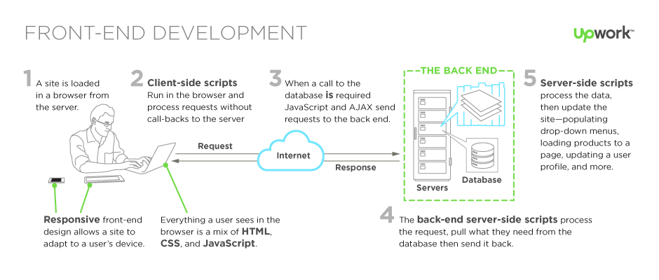

# Intro to web app architecture

This lesson provides an overview of how web apps work, HTML and CSS to lay the foundation for the prototypes NTs will build.

## Learning objectives

* TNTs will learn the basics of how web pages and web apps work.
* TNTs will be able to make HTML and CSS changes.
* TNTs will learn where to go for CSS and HTML info and resources.

## Time required and pace

Total time: 2 hour

* 30 minutes - [**Pre-session**](https://github.com/tnt-summer-academy/Curriculum/wiki/%5BENG1.0%5D-Intro-to-web-apps): background learning, research, and investigations
* 60 minutes - **Instructional Session**
    * 20 minutes - engage: tradeoffs of web apps and native apps
    * 10 minutes - explain: intro to tech and web appp architecture
    * 30 minutes - Demo and explore: W3School HTML and CSS activities
* 30 minutes - [**Post-session**](https://github.com/tnt-summer-academy/Curriculum/wiki/%5BENG1.0%5D-Intro-to-web-apps): review, and investigations

## Pre-session 

View the pre-session [here](https://github.com/tnt-summer-academy/Curriculum/wiki/%5BENG1.0%5D-Intro-to-web-apps)

## Lesson details

### Tradeoffs of web apps and native apps (20 minutes)

1. What is a website and a web app?
      * Website - informational, can be static or dynamic
      * Web app - interactive, user control, saves data, often sign-in (identity)

2. How do web apps compare to apps on iOS, Android, or Windows?
      * Apps targeting a specific operating system are called "native apps" and work just on that platform - iOS, Android, Windows, Linux
      * Some examples of how they compare:

        | Native Apps  | Web apps |
        |---|---|
        | Specific operating system   | Internet browser  |
        | Install from app store, download | URL, access online |
        | Performance optimized for platform | Performance optimized for browser |

3. As a group:
      * List examples of websites, web applications, and native applications
      * Research and list how web applications are both similar and different than native applications, consider a venn diagram
      * Answer: why would you build a web app vs. native app? What are the tradeoffs of each?

4. Come back together:
      * Groups share top similarities and differences
      * Groups share tradeoffs

### How web app works

### Intro to web tech (10 minutes)

There's likely a range of familiarity with web pages, web apps, and how they work. This refresher aims at closing any gaps and providing  the opportunity to dig in and get familiar with resources that will be applicable throughout the program.

1. Why are we building a web app?
      * Quick to prototype
      * Introduction to broadly applicable tech - VS Code, HTML, CSS, TypeScript
      * Many projects - professional, community, philanthropic, for fun... have some web component
      * Some capabilities between web and native apps are closing

2. Tech we will use and introduce over the next week. This lesson focuses on HTML, CSS, and an introduction to TypeScript.

      | Technology / Tooling | Solution |
      |---|---|
      | Programming Language   | HTML, CSS, TypeScript  |
      | Web framework | React |
      | Component library | FluentUI (formerly UI Fabric) |
      | Store management | Redux and state component|
      | Server environment | Node.js, npm|
      | Package manager | Yarn |
      | Source control | Git |
      | Source control tools | SourceTree, Command line, VS Code|
      | Testing infrastructure | Jest |
      | Debugging | VS Code debugger |
      | Text editor | VS Code |
      | Project setup | React create app tool |

3. How HTML, CSS, and TypeScript come together. W3Schools describes it well:
      * Hyper Text Markup Language (HTML) - the language for building webpages
      * Cascading Style Sheets (CSS) - the language for styling webpages
      * TypeScript (JS) - the language for programming web pages

4. TypeScript vs. JavaScript
      * TypeScript (TS) is a super set of JavaScript (JS), JS + additional features and capabilities
      * TS is strongly typed - only certain values can be assigned to certain data types
      * JS is weakly typed - makes conversations between data types, automatically types for you
      * TS is object oriented - built on logical, reusable objects
      * TS is compiled - it generates JS
      * Major benefits: easier to debug, easier to build programs that scale

## Demo (30 minutes)

[Meet Your Instructors page](https://github.com/tnt-summer-academy/Exercises/tree/main/Week_1/ENG1.0/meet-your-Instructors)

* Show a demo and walk through the HTML tags and CSS files
* Ask students to clone and experiment with different CSS properties to see different effects

# Post-session and Stretch

View the post-session [here](https://github.com/tnt-summer-academy/Curriculum/wiki/%5BENG1.0%5D-Intro-to-web-apps)
