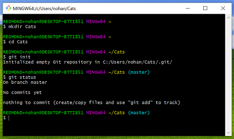
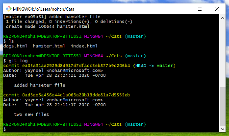

# Introduction to Git and local workflow

This lesson introduces the fundamentals of the Git workflow, Git Bash, and VS Code Git support for local repositories.

## Learning objectives

* TNTs will understand what is source control and why we need it.
* TNTs will learn how their previous code or doc collaboration experience maps to aspects source control.
* TNTs will be able to work with a local and remote repository using Git.

## Time required and pace

Total time: 2 hours

* 75 minutes - learning: Introduction to Git module
* 10 minutes - engage: source control and you
* 15 minutes - explain: recap git basics and best practices
* 10 minutes - explore: create repo
* 10 minutes - elaborate: review trouble spots and talk about next next Git topics

## Pre-session

### What is Git and GitHub

Watch this video - [What is Git and GitHub?](https://www.youtube.com/watch?v=uUuTYDg9XoI)

* Distributed version control system - files and folders + tracking
* It is essential in team software development, working with multiple people on code

### Introduction to Git

Complete this learning module - [Introduction to Git](https://docs.microsoft.com/en-us/learn/modules/intro-to-git/)
The exercises suggests using the sandbox. Instead use Git Bash on your computer to become more familiar with on of the tools we'll be using. There are lots of tools for using Git, just like there are lots of different places to save files or programs to edit text.

After checking the git version number, skip the rest of the Configure Git exercise and skip to Set up your Git Repository.

* Learn what version control is
* Basic Git commands
* Start a project
* Make and track changes
* Fix mistakes

## Session setup

* Git installed
* Prepared to demo commands in git bash and with VS Code

## Lesson details

### Source control and You (10 min)

1. In groups have NTs discuss the following questions:
   * Have you ever worked on a code project or a document with other people? How did you share? Google doc? Emailing? GitHub?
   * When working with other people on code or project, what has gone wrong? Have you gotten versions of the document mixed up? Have you lost changes?

2. Groups come back together and share.

3. Wrap up and connect to source control.
   * Source control enables code collaboration
   * Makes large projects with 1,000s of people possible
   * Makes it easy to manage your own changes and work
   * Source control allows you to try things without fear
   * Git takes practice

### Recap git basics and best practices (15 minutes)

1. Why Git?
   * There are other version control systems. Git is the most popular and an industry standard.
   * It has some advantages over a centralized system, which has a single copy of the code:
       * It's quick to take action on your own copy
       * It works locally, on your own computer, and offline
       * It makes having multiple branches, parallel worlds of code, easier

2. Git Gotchas
   * Git can mean several things - the name of the source control technology, the functionality built into VS Code, the file formats and protocols that underlie the system.
   * It’s both powerful (because it’s open-ended), plentiful (because it’s open source), and sometimes hard to use (because it’s open-ended).
   * It takes practice, it's a learned skill, it's not intuitive - ask your coaches about their Git disasters - everyone has a story.

3. Demo scenario using Git Bash: creating new repo and initial commit
    1. `mkdir Dogs` - create new folder named Dogs
    2. `cd Dogs` - move to the project folder
    3. `git init` - initialize the repository
    4. `touch index.html` - create a new file
    5. `git status` - view the repository status
    6. `git add.` - stage the files to commit and tell get what files to track, "." selects all the new files or files with changes
    7. `git commit index.html -m "New index file"` - add the changes to the repo with the named file, "-m" indicates message included

4. Demo scenario using Git Bash: git revert
    1. `git revert` undoes committed changes by cancelling out the commit with another commit.
    2. `git log` - to view the commit history. What's in the Git log? Hash or long string that identifies the commit, user, data / time, comment.
    
    3. `git reset --hard HEAD^` - head indicates the last commit
    4. `got log` to see the change

5. Demo: Git in VS Code
    1. Open the workspace in VS Code. VS Code has git support built in. It doesn't have all the commands of Git Bash but is convenient when working in VS Code.
    2. Make a change in a file.
    3. Invoke the command either View -> Command Palette or Ctrl+Shift+P.
    4. Type / select "Git: stage all changes".
    5. Invoke the command pallette again and type / select "Git: commit".

6. Best practices
    * To commit changes for all files us ".". It is a best practice to include a short and descriptive message. Your future self thanks you.

## Stretch

[Links and other projects for further learning and exploration]