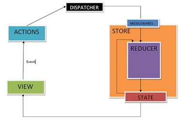

#
# MiddleWare &amp; ThunkActions

This lesson explains what middle wares are and explains how to use thunk actions

## **Learning objectives**

- TNTs will understand the use cases for middle ware
- TNTs will understand how to use thunkActions

## **Time required and pace**

Total time: 1.5 hour

- 5 minutes – Explain MiddleWare
- 15 minutes – Explain Thunk Actions
- 15 minutes - Activity

## **Background / review**

- Redux Actions
- Redux Reducers
- Redux Store

## **Lesson details**

### **What is Middle Ware**

1. Middle ware is a function that allows us to dispatch actions that are more than just objects with a type and values.

1. You can add middle wares to your program when creating your store:

export const store = createStore(GameReducer, applyMiddleware(thunk));

### **Thunk Actions ( 15 minutes):

Thunks is a very common middle ware that allow you to pass in an action that returns a function. The function can do any operations you need to do before then dispatching another action.

### Example:

    export const middleAction = (value: string){

        return (dispatch: any, getState: () => any) => {

            const newString = doStuffToString(value)

            return dispatch(addListItem(newString))

         }

    }
    
    
### **Activity* Add thunkActions to project

### **Use Cases for thunks ( minutes)**

1. You can make modifications to the values passed into an action before dispatching a different action.
2. Actions don't have to be dispatched synchronously if they exist in a thunk action.
3. ThunkActions have access to the store's current state values.
