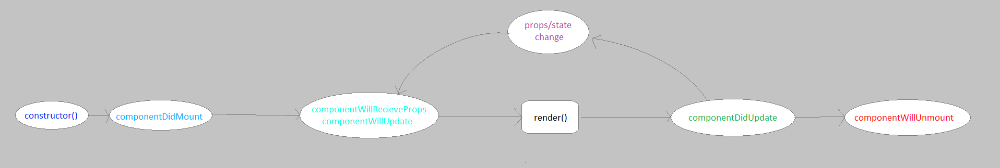

# Components

This lesson explains in detail how a component works and how its methods function

## Learning objectives

* TNTs will understand how a component's key methods function
* TNTs will understand how the store, reducer and actions work together
* TNTs will practice building components

## Time required and pace

Total time: 1.5 hour

* 20 minutes – explain basic component's content
* 10 minutes – Explain component's lifecycle
* 20 minutes - practice

## Background / review

## Lesson details

### Component description(20 minutes)

* Component Properties
* Component State
* Interfaces
* Component render()

A component is an object that returns a Javascript XML Element (JSX Element)

There are two types of components:

1)Function Components

Example:

    function App(Properties:any) {

        return 
Hello World

    }

2) Class Components

       export default class Tile extends React.Component<Properties, State>{

          render() {

              return (

                  
Hello World

              )

          }

       }

### Class Component ( 10minutes)

1. Render (required): This method returns the JSX element to be displayed by the class. It runs whenever the component's view updates.
2. Properties (optional): This are arguments passed into the component from its parent components. They cannot be changed by the component.
3. State (optional): This is are arguments that exists only withing the component. Changing them causes the component to update

### Function Component ( 10minutes):

1. The function is expected to return the JSX element to be displayed.
2. Properties (optional): These arguments are passed in from the component's parent similarly to passing parameters to a function. They cannot be changed in the component.
3. UseState: A hook function that returns a state variable, giving function components a way to manipulate a state the way class components do.

### LifeCycle Methods (10 minutes)

These are methods that are trigger through out a components existence from when they're constructed to when they are dismissed.

[https://www.w3schools.com/react/react\_lifecycle.asp](https://www.w3schools.com/react/react_lifecycle.asp)

### Build components (x minutes)
*Exercise for NTs building custom button as functional component, and a class based component*

## Stretch (20 minutes)

  1. Convert a giving class Component to a functionComponent.
  2. Convert a given function component to a class component.
