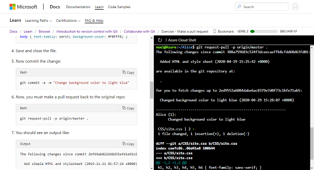
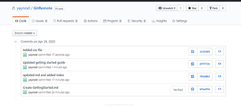

# Remote repositories and GitHub

This lesson introduces the core concepts for collaborating with Git and working with a remote repository.

## Learning objectives

* TNTs will understand the basic workflow for how multiple people work with git.
* TNTs will be able to clone a repository, make a pull request, push changes.
* TNTs will learn how to create and use repositories on GitHub.

## Time required and pace

Total time: 2 hours

* 55 minutes - pre-session: Collaborate with Git module
* 20 minutes - explain: recap learning
* 30 minutes - explore: create and use a repo on GitHub
* 15 minutes - elaborate: review trouble spots

## Pre-session

### Collaborate with Git

Complete this learning module - [Collaborate to Git](https://docs.microsoft.com/en-us/learn/modules/collaborate-with-git/)
Use the sandbox for this exercise to preserve your local git configuration.

The module covers the following:

* Clone a repository
* Introduction to pull requests
* Stash changes
* Push changes

## Session set up

* GitHub - ready to make and clone a remote repository

## Lesson details

### Recap cloning and pull requests (20 min)

1. The learning module introduced the basics of cloning a repository and contributing to a repository using `git clone` and `git pull`. These are the building blocks for collaborating with Git and working with a remote repository.

2. It's called a "pull request" because it's asking the master branch to pull in the changes.

3. Demo: Create a new repository in GitHub and clone

   1. We'll now walk through the process of cloning a repository from GitHub. We'll be creating a private repository in our own accounts.
   2. [Go to GitHub](https://github.com/) and create a new repository.
   3. Make an initial commit.
   4. With Git Bash make a new directory and `git clone` using the URL provided by GitHub.
   5. Show the folders and open the workspace in VS Code.

4. Demo: Make changes in VS Code and create a pull request

    1. With the folder open in VS code, add a new file and make changes to the existing file.
    2. In Git Bash, `git .add` to stage the files.
    3. `git commit` to create the commit. The changes are now committed locally.
    4. `git request-pull -p origin/master .` to create the pull request.
    5. `git push` to push the changes to the remote repo.

5. Demo: Clone from VS Code

    1. It's also possible to clone a repository from VS Code.
    2. Open the palette with Ctrl+Shit+P (Cmd+Shift+P for Mac OS).
    3. `Git: clone` prompts for a URL where you can paste from GitHub.

6. Poll for questions

### Create and use a repo on GitHub (30 minutes)

The goal is to create a repo on GitHub, clone the repository, make changes in VS Code and push the changes back to GitHub.

1. Create a new private repository on GitHub. Make an initial commit adding a file from the website.
2. Clone the repository to your computer.
3. Open the folder in VS Code.
4. Add a new file in GitHub, edit the existing file.
5. Commit changes and make a pull request.
6. View the changes in GitHub.
7. Continue making changes in VS Code. Check out the `git diff`. Check out `git log` to see the tracking of the commits.
8. Share a screenshot from GitHub of the commit history.

### Review trouble spots (15 minutes)

In your team's Team channel, discuss:

* What went well?
* What was difficult?

## Wrap up

Create a repository on GitHub for your to-do app and move your local repository to GitHub.

1. Prepare your repository to move. Commit any pending changes.
2. Create a new repository in GitHub in the TNT organization, not a private repository. Name the repository your alias-todo.
3. Follow the instructions provided by GitHub "..or push an existing repository from the command line".

As you continue to build on the to-do app in future activities, use the remote repository.
