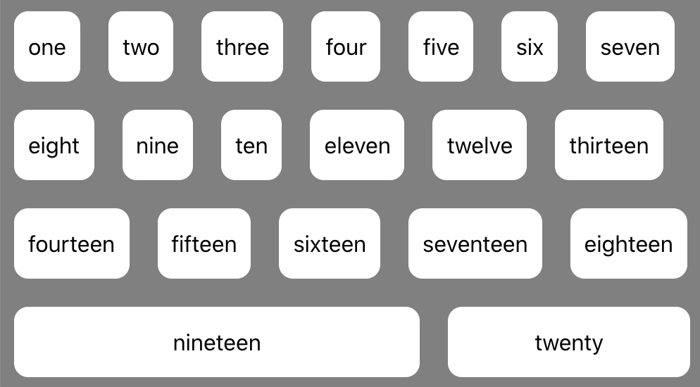

# View Component Layout

This lesson introduces how to create components that can display a variety of data and distribute space dynamically.

## Learning objectives

* TNTs will learn how to layout a table with React
* TNTs will understand the basics of CSS Flexbox layout
* TNTs will practice using Flexbox

## Time required and pace

Total time: 2 hours, 30 minutes

- 30 minutes - **Pre-session**: background learning, research, and investigations
- 60 minutes - **Instructional Session**
  - 15 minutes – Building a table with react
  - 15 minutes – Examine CSS Flexbox
  - 30 minutes - Practice

## Pre-session

*Prepare for the session* [here](../wiki/[ENG2.2]View-component-layout)

## Lesson details

Components are most useful when their contents are generated on the fly based on the data passed to them. But how can you layout a web page when you don't know what the final content of the page will be, or the content will keep changing?

 Two useful options for working with this kind of dynamic layout are HTML Tables and CSS Flexbox.

### Building a Table component (15 minutes)

Start to think about the elements required for a basic HTML table such as a table header and table rows. These elements can help us start to build a Table component that can be reused with a variety of data.

Below a basic HTML Table Element

    <table>
        <thead>
            <th>Name</th>
            <th>Email</th>
            <th>Phone Number</th>
        </thead>
        <tbody>
            <tr>
                <td>John Appleseed</td>
                <td>john.appleseed@microsoft.com</td>
                <td>(555) 555-5555</td>
            </tr>
        </tbody>
    </table>

If we configure our Table component with data this will allow us to dynamically create the table headers and rows. We can convert the basic table element above into our Table component below.

    render() {
        return (
            <table>
                <thead>
                    {this.headers()}
                </thead>
                <tbody>
                    {this.rows()}
                </tbody>
            </table>
        )
    }

### CSS Flexbox layout (15 minutes)

The Flexbox Layout is an efficient way to layout and distribute **child items** in a **parent container** allowing for child items to either take up space or shrink based on the UI requirements. This makes Flexbox an incredibly useful way to style the layout for components

When configuring a Flexbox both the Parent Container and Children Items have CSS styles that you set to meet your UI needs. We will go more in depth in ***ENG3.0 Adaptive Layouts***.

Below are a few examples of Flexbox properties for both the Parent Container and Child Items.

#### Parent Container Property: *flex-direction*

*Flex-direction*: sets the flow order for each successive child item element in the parent container. 
Options are:

- row
- row-reverse
- column
- column-reverse

    flex-direction: row | row-reverse | column | column-reverse

#### Child Item Shorthhand Property: *flex*

Options are:

- *Flex-grow*: a unit-less value for the relative size of the child element compared to other elements.
- *Flex-basis*: an optional, minimum default size guaranteed to the child element

    flex: flex-grow flex-basis
    		

[https://css-tricks.com/snippets/css/a-guide-to-flexbox/](https://css-tricks.com/snippets/css/a-guide-to-flexbox/)

### Practice: Build a Keyword Collection component with CSS Flexbox (30 minutes)

You will build (2) React components:

1. Keyword component
2. KeywordCollection component

Using CSS Flexbox layout multiple Keywords and apply Flexbox properties to achieve the results below

## Stretch (20 minutes)

  1. Add an input field above your component to accept an input from a user and add it to your Keyword Collection component
