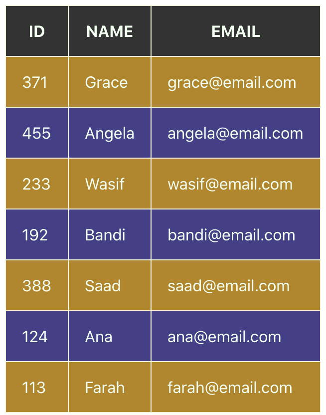
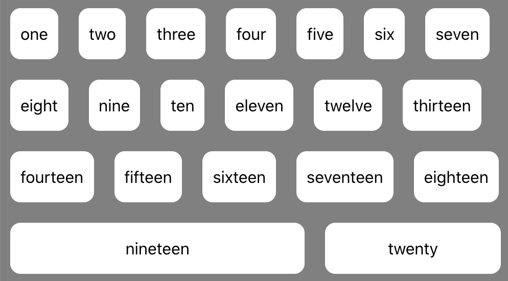

# View Component Layout

This lesson introduces how to create components that can display a variety of data and distribute space dynamically.

## Learning objectives

* TNTs will learn how to layout a table with React
* TNTs will understand the basics of CSS Flexbox layout
* TNTs will practice experimenting with and troubleshooting CSS in the browser

## Time required and pace

Total time: 2 hours, 30 minutes

* 15 minutes – Building a table with react
* 15 minutes – Explain the basics of CSS Flexbox
* 30 minutes - Setup for Exercise

## Pre-session

*Prepare for the session* [here](../wiki/[ENG2.2]View-component-layout)

## Lesson details

Components are most useful when their contents are generated on the fly based on the data passed to them. But how can you layout a web page when you don't know what the final content of the page will be, or the content will keep changing?

 Two useful options for working with this kind of dynamic layout are HTML Tables and CSS Flexbox.

### Building a Table component (15 minutes)

Start to think about the elements required for a basic HTML table such as a table header `<th>`,  table rows `<tr>`, and table data `<td>`. These elements can help us start to build a Table component that can be reused.

Below a basic **HTML Table Element** structure

    <table>
        <thead>
        	<tr>
        	  <th>ID</th>
            <th>NAME</th>
            <th>EMAIL</th>
           </tr>
        </thead>
        <tbody>
            <tr>
            		<td>371</td>
                <td>Grace</td>
                <td>grace@email.com</td>
            </tr>
            <tr>
                <td>455</td>
                <td>Angela</td>
                <td>angela@email.com</td>
            </tr>
            ... more rows ...
        </tbody>
    </table>

If we configure our Table component with data this will allow us to dynamically create the table headers and rows. We can convert the basic table element above into our Table component below, where we use a dataset along with the two functions, ***headerNames()*** and ***dataRows()*** to generate the header row and data rows for the table dynamically.

    render() {
        return (
            <table>
                <thead>
                    <tr>{this.headerNames()}</tr>
                </thead>
                <tbody>
                    {this.dataRows()}
                </tbody>
            </table>
        )
    }

### CSS Flexbox layout (15 minutes)

The Flexbox Layout is an efficient way to layout and distribute child items in ANY parent container allowing for each child item to either take up space or shrink based on the UI requirements and the number of items added.

When configuring a Flexbox layout both the Parent Container and Children Items have properties you set to meet your UI design needs. We will go more in depth in ENG3.1 Adaptive Layouts, but [a few examples of Flexbox properties](https://css-tricks.com/snippets/css/a-guide-to-flexbox/) for both the Parent Container and Child Items should get you started.

#### Parent Properties:

    flex-direction: row | row-reverse | column | column-reverse

#### Children Properties:

#### Child Item Shorthhand Property: *flex*

Options are:

- *Flex-grow*: a unit-less value for the relative size of the child element compared to other elements.
- *Flex-basis*: an optional, minimum default size guaranteed to the child element

    flex: flex-grow flex-basis
    		

### Practice: Build a Keyword Collection component with CSS Flexbox (30 minutes)

You will build (2) React components:

1. Keyword component
2. KeywordCollection component

Using CSS Flexbox layout multiple Keywords and apply Flexbox properties to achieve the results below

## Stretch (20 minutes)

  1. Add an input field above your component to accept an input from a user and add it to your Keyword Collection component
