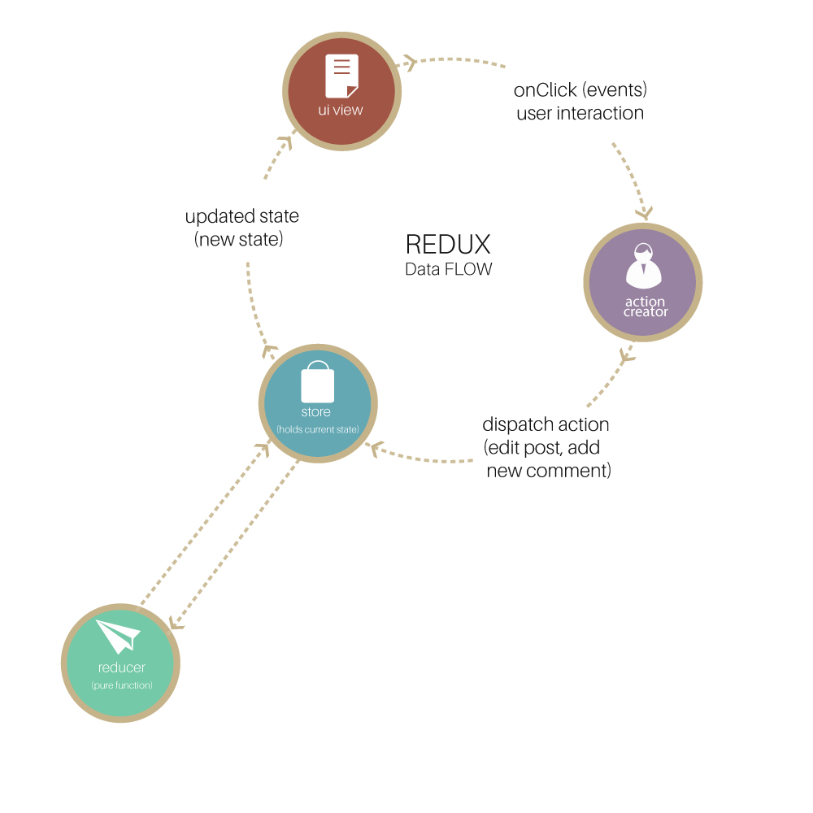

# Intro to Redux

This lesson explains what Redux is and overviews how to use it in a practice. Another lesson will cover it deeper. 

## Learning objectives

* TNTs will understand the importance of Redux
* TNTs will learn how the store, reducer and actions work together
* TNTs will have a basic understanding of Redux

## Time required and pace

Total time: 1 hour

* 45 minutes – explain what is redux and the benefits
* 15 minutes - rules to follow for easier development

## References

* [Redux basic tutorial](https://redux.js.org/basics/basic-tutorial)

## Lesson details

### What is Redux and why do we need it?

* Redux is a flux-based state management container.
* React permits to solve the problems of maintaining application state and making it consistent with the UI.
* Redux, on the other hand, was introduced to maintain the application state. Each component having a state makes it complicated to maintain a general application state. In addition, there are many dependencies between components.
* So far, you have only been exposed to immutable properties passed into components and mutable states changed within components.
* What if we need to pass a mutable property between components, change said property and have the change affect different components?
* Redux lets us keep a state that persists through out the app and can be accessed by every component

There are four basic parts in Redux: Store, Actions, Reducer, and Connect. Let's go over what each part does and provide an illustrative example. 

[image to add]

### Three principles of Redux

* Single source of truth - the global state of the application is saved in a single store.
* State is read-only - the only way to change the state is to emit an action.
* Changes are made through pure functions - these functions are called reducers. They take the state and an action as parameter and return a new state.

### Redux concepts

#### Store

* The whole state of the app is stored in an object tree inside a single store. 
* The store is created once.
* The only way to change the store is through actions. 

#### Actions

* Actions are used to change the state of an object. 
* Actions are sent from the application to the state.
* Actions are the only source of information for the store.

#### Reducer

* The reducer ties together Actions and Store and returns a new state object. 
* This is a collection of functions that map actions to the store.

#### Connect

Connect is used to connect components, property maps and action maps to the store. 

```js
import { connect } from 'react-redux'
import { increment, decrement, reset } from './actionCreators'

// Map store properties to component properties
const mapStateToProps = (state /*, ownProps*/) => {
  return {
    counter: state.counter
  }
}

// An object full of action creators
const mapDispatchToProps = { increment, decrement, reset }

// Connect Counter component to the redux store
export default connect(
  mapStateToProps,
  mapDispatchToProps
)(Counter)
```

#### Actions

This is a function used to change the state

```js
export function addTodo(payload) {
  return { type: "ADD_TODO", payload }
};
```

#### Store

This is the state object (key value pairs) that exists throughout the app. The store is generally defined once at the top of your app.

```js
// Example of a state object
const appState= {
   todos: []
}
```

#### Reducer

The reducer ties together Actions and Store and returns a new state object. This is a collection of functions that map actions to the store.

```js

const initialState = {
  todos: []
};

function reducer(state = initialState, action) {
  if (action.type === "ADD_TODO") {
    return Object.assign({}, state, {
      todos: state.todos.concat(action.payload)
    });
  }
  return state;
}

export default reducer;
```

#### Let's put all 4 parts together



### Redux programming

#### Store

* Store is an object with several methods
  * `createStore(<reducer> [<preloaded state>, <enhancer>])` - creates a Store and returns the whole state tree of the application. 
  * `getState()` - returns the complete state tree of the application.
  * `dispatch(action)` - dispatches an action and returns the next state. This is the only way to trigger a state change.
  
#### Actions

* Actions are objects 
  * They have a `type` property that indicates the type of action being performed.
  * The `type` is typically a string constant.
  * Other properties specific to the app are added.
* Action creators are functions that create / return actions.

#### Reducer

* A reducer is a function

#### Connect

### Rules to follow for easier development (15 minutes)

Use interfaces instead of 'any' type

* Create an interface for your state to ensure that no reducer can put in a property that shouldn't exist.

```js
export interface AppState {
  todos: string[];
}
```

* Create an interface for your actions and an enum for your action types. This ensures that your reducer won't expect a property that doesn't exist on that action type.

```js
// Action Types
export const ADD_TODO = "ADD_TODO"

export interface AddToDoAction extends Action {
   type: typeof ADD_TODO,
   payload: string
}

// Action Creators
export function addToDo(payload: string) {
   return {
      type: ADD_TODO,
      payload: payload
   }
}
```
