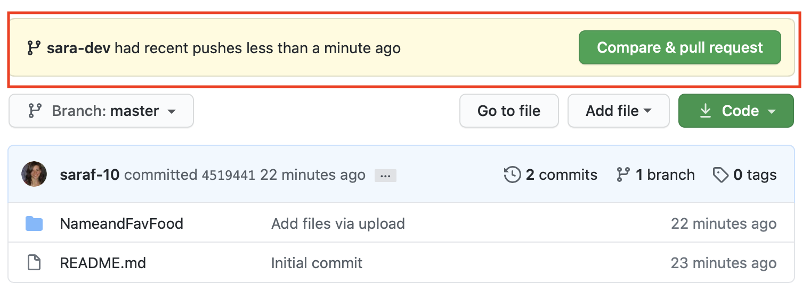
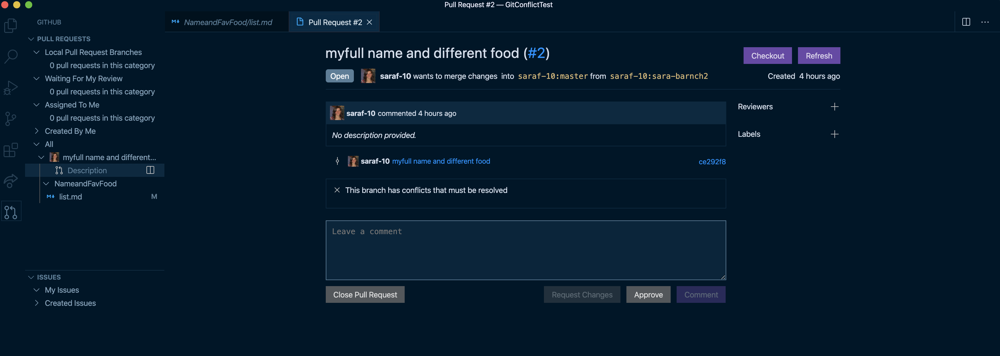

# Branching, merging, and merge conflicts

This lesson introduces branching for team collaboration. This is how you work together on projects!

## Learning objectives

* TNTs will understand the basic of branching, merging, and resolving conflicts.
* TNTs will learn what is a merge conflict, what causes them, how to resolve and reduce.
* TNTs will be able to create and merge a branch locally and with GitHub.

## Time required and pace

Total time: 2 hour

* 60 minutes - [**Pre-session**](https://github.com/tnt-summer-academy/Curriculum/wiki/%5BENG2.5%5D-Branching-merging-and-merge-conflicts): background learning, research, and investigations
* 60 minutes - **Instructional Session**
    * 30 minutes - explain: recap learning, lesson Demos and best practices
    * 20 minutes - explore: Try it: Game Play
    * 10 minutes - elaborate: regroup and review
* [**Post-session**](https://github.com/tnt-summer-academy/Curriculum/wiki/%5BENG2.5%5D-Branching-merging-and-merge-conflicts): review, and investigations

## Pre-session (60 minutes)

Prepare for the session [here](https://github.com/tnt-summer-academy/Curriculum/wiki/%5BENG2.5%5D-Branching-merging-and-merge-conflicts)

## Session set up

* GitHub - create repository in group from NameandFavFood demo in Samples

## Lesson details

### Recap learning (30 minutes)

Here's how the team development process is applied with GitHub: [Understanding the GitHub Flow](https://guides.github.com/introduction/flow/).
<table style="border: none">
    <tr align="center">
        <td> 
    </td> 
 </tr>
</table>

1. **Demo**: cloning, branching, committing a repo from GitHib.
    1. We're going to review the basics of creating a branch and merging using GitHub.
    2. With VS Code integrated Terminal, clone the NameandFavFood repository.
    3. Create a new branch and check out to the branch.
    4. Open and edit the file in VS Code, adding name and favorite food.
    5. Commit the changes to the branch.
    6. Open a pull request to merge to main.
    7. In GitHub look at the pull request and complete the pull request and merge.

<table style="border: none">
    <tr align="center">
        <td> </td> 
    </tr>
</table>

2. **Demo**: show a merge conflict
    1. From main, make a change in GitHub added a fictitious name and food.
    2. From VS Code on the branch, make a change adding a different change.

    <table style="border: none">
        <tr>
            <td></td>
            <td> </td>
        </tr>
    </table>

3. **Demo**: Show Pull Request in VS-Code
    * Install VS Code [Pull Request extension](https://marketplace.visualstudio.com/items?itemName=GitHub.vscode-pull-request-github)
    * Show the navigation and open the created pull request in previous Demo in VS-code
    <table style="border: none">
     <tr>
            <td></td>
            
    </tr>
    </table>

4. **Best practices to resolve and reduce merge conflicts**
    1. Git attempts to resolve differences in code. Merge conflicts occur when Git is unable to resolve the differences. This occurs when there are changes made to the same part of the same file on two different branches.
    2. Before attempting to merge, make sure any work in progress is either committed or merged. If you need to `git merge --abort` this will prevent you from losing changes.
    3. Take a minute (or several) to understand the conflict. This will help you pick a solution to resolve the conflict.
    4. Decide what code should be included in main after the merge. Make the changes to resolve the conflict.
    5. Fetch from main and pull into your branch frequently to stay in sync.
    6. Plan the work. Breakdown who is working on what and what may conflict.

### Try it: Game Play (20 minutes)

1. Together we're going to create a whole bunch of merge conflicts.
2. Navigate to the Sign-In Exercise in the Exercises Repository.
3. Play the game using these TWO RULES

    - You will **ONLY** edit the file when on your **feature branch**!
    - You will **NEVER** commit changes when on the **main branch**!

**Setup in VS Code and use VS Code integrated Terminal**

4. Open VS Code
5. Clone the repo into a new directory
6. Create a new branch, call it **sign-in\*-yourName\*** (this will be your ***feature branch***) and check out this new branch using "**git checkout -b \*your feature branch name\***"
7. Modify the *sign-in.txt* code to add your name and GitHub username below my name
8. Commit the changes
9. Push your feature branch to Github using "**git push origin \*your feature branch name\***"

**Using GitHUB**

7. Make a Pull Request from your branch to main to push changes
8. resolve the merge conflicts.
    * Be mindful not to delete other people's response.
    * You may have to deal with merge conflicts more than once through this process.
8. Delete your branch when you're done.

### Regroup and review (10 minutes)

1. Take a look at the repository commit history, look at all the changes!
2. At branches or pull requests outstanding?
3. Poll the room - what made this difficult? What helped?

## Post-session

View the post-session [here](https://github.com/tnt-summer-academy/Curriculum/wiki/%5BENG2.5%5D-Branching-merging-and-merge-conflicts)
