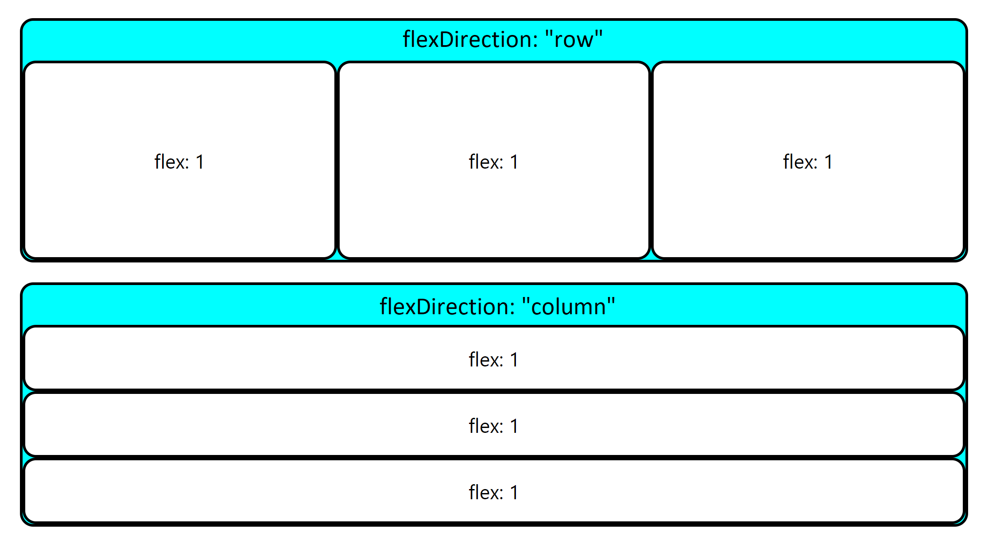
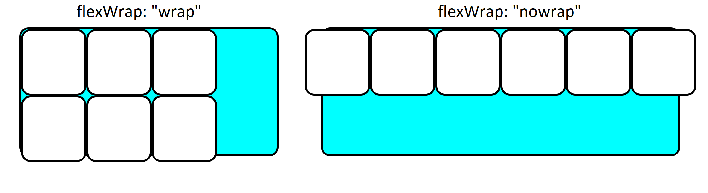
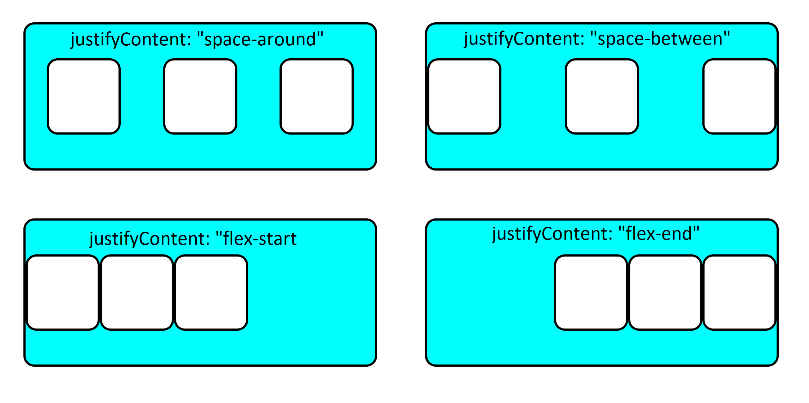

**Adaptive Layouts**

This lesson explains how to make your content's position adapt to your screen size

**Learning objectives**

- TNTs will be able to add constraints to layouts
- TNTs will understand how flex influences your styles

**Time required and pace**

Total time: 1.5 hour

- **** 10 minutes - explain: Adaptive units vs fixed units
- **** 10 minutes - explain: Flex property
- **** 20 minutes - Explore the effects of different properties on a flex container

**Background / review**

- **** CSS properties

**Lesson details**

**Adaptive Layouts**

When assigning a size to an element we typically use fixed units like pixels or inches, however we can also use units that change according to the size of the viewport.

1. **vw/vh** : Size changes relatively to the viewports width/height
2. **Vmin**: Size changes relatively to the smaller of the viewport&#39;s dimensions (height or width)
3. **vmax**: Size changes relatively to the larger of the viewport's dimensions (height or width)
4. **%**: Size changes relatively to the parent's size
5. **Rem**: size changes relatively to the root element

**Display: Flex**

Setting a container&#39;s &#39;diplay&#39; property to &#39;flex&#39; allows you to manipulate its children with their &#39;flex&#39; properties.

1. **Flex** : Setting a child's flex to an integer makes it fill as much of the container as possible.

If there are multiple children in the container each child will fill an amount of space proportional to it's flex. This means if all the children's flex is set to 1 they will take up an equal amount of space. If a child is set to 2 and the rest are 1, it will take up twice the amount of space.

1. **Flex-Direction** : The flex direction determines the axis the container is oriented on.

2. **Flex-Wrap** : Usually the items will all try to fit on one line. Setting this property to wrap allows the items to flow to a new line rather than overflow the view

3. **Justify-Content** : Sets the alignment on the main axis

4. **Align-Items** : Sets the alignment on the cross axis
