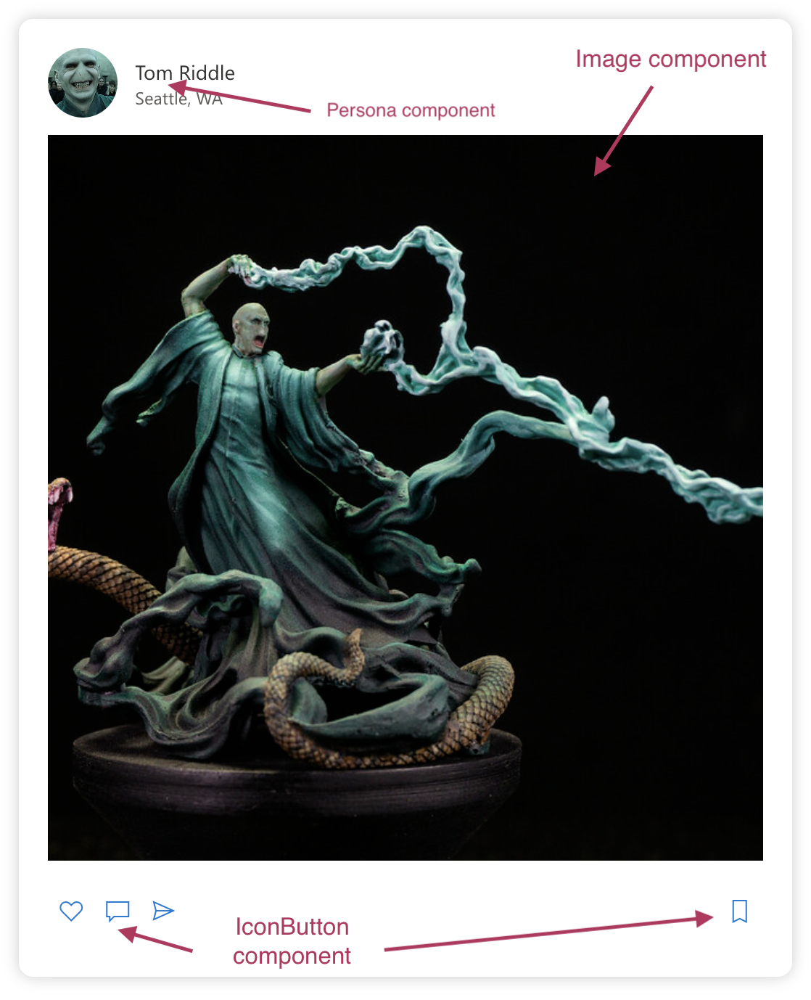

# Component Libraries

This lesson provides an overview of component libraries (specifically Fluent UI), including both how to use FluentUI and tips on reading documentation

<!---
* We'll have an hour for this

TODO:

* ==> Some sort of 'best practices' guidance would be great at the end. <== 

* Change the examples to use a person rather than demo text?

* Should we have an example for 'how to get data from a FluentUI widget?  Like, how do you get the text the user typed into a text box?

* I think that "Styling Your Page with CSS" will be covered in the Web Design track prior to now, yes?
  If that's true then we can leave it out of here

*  GIFs/ images for pre-session set up
	- npm ...
	- create-react-app
	- copy the starter file over teh c-r-a file
-->

## Learning objectives

* TNTs will understand what component libraries are
* TNTs will write code that demonstrates how to import component libraries into their project, and how to utilize existing components/controls/widgets in their existing project
* TNTs will write code that demonstrates how to create and use new, custom components in their existing project

## Time required and pace

Total time: 1.25 hours

* 60 minutes - pre-session: background learning, research, and investigations
	* 15 minutes - Installing/Using Fluent UI
	* 15 minutes - Examine demo code
	* 30 minutes - Reflect on demo code, read the docs
* 75 minutes (1:15) - Session:
	* 15 minutes – answer review questions in your table group
	* 15 minutes – what are component libraries
	* 15 minutes – using components inside your components
	* 15 minutes - how to read documentation
	* 15 minutes - Reacting to user input on the components
* 30 minutes - post-session: what to continue working on, how it ties into the next sessions or projects
	* 15 minutes - Styling the FluentUI components with the Theme Designer
	* 15 minutes - Styling Your Page with CSS 
	* 30 minutes - practice building a new React component using Fluent UI components
	* 15 minutes - Reflect, incorporate, plan

## Pre-session

### Installing/Using Fluent UI

We're going to start with a quick demo.  During the session we'll elaborate on this and we'll discuss best practices

We will use Microsofts Fluent UI to practice using a component library. Using an existing project in the terminal use `npm` to install the component library:

    npm install @fluentui/react

Using a few steps we can start using Fluent UI's `Persona` component. Let's start by looking at a complete, finished single file example.  We'll go through highlights of this after you see the code.  For now you should be able to get this working by either finding an existing app or else creating a new react app project, and then replacing the 'App.tsx' file with this:

**App.tsx**:
```
import React from 'react';
import { Persona } from "@fluentui/react"

class App extends React.Component {

  public render() {
    return (
      <div className="App">
        <h1>Hello Component Library!</h1>
        <h2>This example has everything in a single .TSX file</h2>
        <div style={{ backgroundColor: "yellow" }}> {/* Div is here only to highlight where the component starts & ends*/}
          <div id="persona-container">       {/* DO WE REALLY NEED THIS??????? */}
            <Persona
              text="Text"
              secondaryText="Secondary Text"
              imageUrl="https://th.bing.com/th/id/OIP.x8Jwnqge_gR1-412yihxJQHaHa?w=177&h=173&c=7&o=5&dpr=1.25&pid=1.7"
            />
          </div>
        </div>
      </div >
    );
  }
}
export default App;
```

### Examine demo code

Some things to pay particular attention to:

1. You've probably seen Persona components (or something that looks very similar) but they're not quite as ubiquitous and standardized as, say, Buttons.  Take a minute to [skim through the documentation page for Personas, focusing on the numerous, numerous visual examples](https://developer.microsoft.com/en-us/fluentui#/controls/web/persona) to get a feel for what they usually look like and how they're usually used.

1. Importing the component at the top of your file makes a specific user-interface component/control/widget available for use in this file.  Note that if you want to use other things (like Buttons, Checkboxes, lists, etc) you'll need to add them to this list too.

       import { Persona } from "@fluentui/react"

1. You actually put the component on the page with these lines:

	```
	<Persona
		text="Text"
		secondaryText="Secondary Text"
		imageUrl="https://th.bing.com/th/id/OIP.x8Jwnqge_gR1-412yihxJQHaHa?w=177&h=173&c=7&o=5&dpr=1.25&pid=1.7"
	/>
	```
	* The 'text' attribute is usually used for the name of the person that you're showing
	* secondaryText can be used for transient detail about the person
	* imageURL will be used to show a picture

1. Make sure to add the Persona component in the render function of a `Component` class (such as the `App` class, which extends React.Component). 

1. There's more to the file but the above points are the most important ones.

#### Questions:

Here's a couple of questions to guide your inquiry at this point:

1. If you wanted to change the image and text in the `Persona` control, how would you do that?

1. Look at the line that reads `<div id="persona-container">`.  Once you've gotten the rest of file working and you've had a chance to look through it: how can you figure out if this element is required or not in this program?  How can you be sure that this will be the right every time you use the Persona component?

### Reflect on demo code, read the docs

At this point you should think about the demo code, play around with it, and reflect on how best to use 'pre-fab' components (like `Persona`) in your app

[Skim through the docs to get a feel for what sort of widgets are available](https://developer.microsoft.com/en-us/fluentui#/controls/web).  If you want to search online for more resources it can be useful to seach for "FluentUI _gallery_" or "FluentUI _screenshots_" 

**Note**: React seems to use the word 'component' a lot to describe reusable chunks of user-interface functionality (like a button, or a text box you can type into).  Be aware that there's at least a couple other words that more-or-less mean the same thing.  **Widget** is a word that was originally used on Unix (I think)(CITATION NEEDED :) ), while **control** was the word frequently used on Windows.  Nowadays these words are more-or-less interchangeable

## Session (The lesson)

### Pre-session Review Questions

Working within a group, do your best to answer the following questions:

1. Before you even try to get the app working, what do you need to do?  How do you do that?

1. If you wanted to change the image and text in the Persona control, how would you do that?

1. Why do you need the import statement at the top?
	- Stretch Question: Why can't you leave out the { } like you can when importing react?

1. Do you think you need the `<div id="persona-container">` in the above example?  If it can be left out of this example: can you always leave it out (i.e., it's never needed), or is the div only optional in this example?

1. What sort of UI components / widgets did you find (if any)?  What looks useful for your app?

1. Why do you think a collection of widgets (like this FluentUI library) would be useful in general?

### What are component libraries

A component library is a collection of components installed generally through a package manager that provides common solutions whether it's a UI library, testing library, etc.

Why use a component library?

* Prebuilt out of the box solutions
* Increase speed of delivery
* Customization of an application
* Allows focus on core application competencies vs boilerplate features

Things to consider before using a component library

* Components may become outdated as other technologies advance
* Consider the popularity and communitity activity for the component library
* Ease of use generally through an API defined by the component library
* Tradeoffs between speed, customization time, cost and immediate business needs

### Using components inside your components

![Yo Dawg joke: Yo Dawg I heard you like components so I put a component inside your component, So you can reuse your components while reusing the library's components][YoDawg]

In this example, we'll look at putting the Persona component inside new custom component that you create, all inside of a single `.TSX` file

Here's the finished code for a single-file example of using Fluent UI's `Persona` component in a new component of our own.  We'll go through highlights of this after you see the code:

```
	import React from 'react';
	import { Component } from 'react';
	
	import { Persona, IPersonaProps } from "@fluentui/react"

	export class MyPersona extends Component<IPersonaProps> {
		render() {
		return (
			<div id="persona-container">
			<Persona
				imageUrl={this.props.imageUrl}
				text={this.props.text}
				secondaryText={this.props.secondaryText}
			/>
			</div>
		);
		}
	}

	class App extends React.Component {

		public render() {
		return (
			<div className="App">
			<h1>Hello Component Library!</h1>
			<h2>This example has everything in a single .TSX file</h2>
			<div style={{ backgroundColor: "yellow" }}> {/* Div is here only to highlight where the component starts/ends*/}
			
			<MyPersona
				text="Text"
				secondaryText="Secondary Text"
				imageUrl="https://th.bing.com/th/id/OIP.x8Jwnqge_gR1-412yihxJQHaHa?w=177&h=173&c=7&o=5&dpr=1.25&pid=1.7"
				/>

			</div>
			</div >
		);
		}
	}
	export default App;
```
Some things to pay particular attention to:

1. Notice that we had to import a couple of interfaces:

	`import { Persona, IPersonaProps } from "@fluentui/react"`

	This is necessary so that we can accept the standard Persona attributes (text, secondaryText, imageUrl) in our MyPersona in the JSX/HTML.

1. Because we want our new component (`MyPersona`) to extend FluentUI's `Persona` we need to tell Typescript that via this line:

	`class MyPersona extends Component<IPersonaProps> `

	We tell Typescript that our new component accepts the same attributes as a normal Persona component by passing the IPersonaProps here.

	* This is what allows us to write `this.props.text`, etc

1. Other than that the MyPersona component should closely resemble other components you've seen.

1. Inside the `App` class you can now use the MyPersona component.

Note: normally your component would have several different widgets/controls but we want our examples to start simple and build up.

#### Exercise

Take the above code (with the component AND the App class) and separate the component out into a separate file.

There's an [EXAMPLE SOLUTION](ENG3.3/SeparatingComponentIntoFiles.md) here.  The idea is that you can use this to check your work during the class session, as a reference afterwards, and also to help get you unstuck if you and your group are stuck.
 
### How to read documentation

[https://developer.microsoft.com/en-us/fluentui#/get-started](https://developer.microsoft.com/en-us/fluentui#/get-started)

Most (if not all) libraries will contain a "How to" section to quicky get started but may not include how to use all the components. This is where knowing how to interpret documentation and more importantly class interfaces.

A few tips on reading documentation:

* Look for examples or demos
* Class interfaces

Below is a link to Persona properties interface.

[https://developer.microsoft.com/en-us/fluentui#/controls/web/persona](https://developer.microsoft.com/en-us/fluentui#/controls/web/persona)

* Explain interfaces
* Explain the use of 'extends' and how to navigate interface extensions

Documentation is also good for when you're not sure if something will *always* work - like "do you need the persona-container?"

Answer ([AFAICT](https://www.urbandictionary.com/define.php?term=afaict): No.  B/c it's not mentioned on the documentation page anywhere)

### Reacting to user input on the components
Demo: In this code sample we'll change the 'text' that the persona displays into a 'click counter', so that our component will do something every time you click on it.

```
import React from 'react';
import { Component } from 'react';
import { Persona, IPersonaProps } from "@fluentui/react"

interface IState {
  click_count: number
}

export default class MyPersona extends Component<IPersonaProps, IState> {

  constructor(props: any) {
    super(props);
    this.state = {
      click_count: 0
    }
  }

  private moveToNextText = () => {
    console.log("Hi " + this.state.click_count);
    this.setState({ click_count: this.state.click_count + 1 });
  }

  render() {
    return (
      <div id="persona-container">
        <Persona
          imageUrl={this.props.imageUrl}
          text={this.props.text + " You clicked this " + this.state.click_count.toString() + " times!"}
          secondaryText={this.props.secondaryText}
          onClick={this.moveToNextText}
        />
      </div>
    );
  }
}

```
Important details:

1. Because we want our component to have a variable in it's state we'll need to add this:

	```
	interface IState {
		click_count: number
	}	
	```

1. Notice that we pass in the `IState` when declaring the class: `class MyPersona extends Component<IPersonaProps, IState>`

	* You must list out the props (`IPersonaProps`) THEN the state (`IState`)

1. We'll set up the initial state in the constructor:

	```
	constructor(props: any) {
		super(props);
		this.state = {
			click_count: 0
		}
	}
	```
	* You **MUST** call `super(props);` and you must do this first

1. The actual method (function) that gets called is this one.  Note that it must go "inside" the class:

	```
	private moveToNextText = () => {
		console.log("Hi " + this.state.click_count);
		this.setState({ click_count: this.state.click_count + 1 });
	}
	```
 1. Having defined the method that we _want_ to run is great, but doesn't tell TypeScript to connect that method to any particular action in our component.  This line will tell Typescript that when the component is clicked it should run that method:

	```
	onClick={this.moveToNextText}	
	```

## Post-session

### Styling the FluentUI components with the Theme Designer

Component libraries are great but we're going to want to put our own brand on our project.  This means things like changing colors, fonts, etc.

FluentUI has a Theme Designer, which allows you to quickly and visually try out different combinations of colors: https://fabricweb.z5.web.core.windows.net/pr-deploy-site/refs/heads/master/theming-designer/index.html

Try it out, play around with it, and once you've got something that you like click the 'Export' button.  Remember this, and then set up a file to try this out in:

You should be able to take the following single-file demo program and paste it into a react app (either an existing one or a newly created one).

Once you've got this working you should try copy the code from the 'Export' step (two paragraphs up) and then paste it over the similar spot in the starter code:


**App.tsx**:

```
import React from 'react';
import { createTheme } from "@uifabric/styling"
import { Customizations, DefaultButton, PrimaryButton, Toggle } from "@fluentui/react"

const myTheme = createTheme({
  palette: {
    themePrimary: '#0ed400',
    themeLighterAlt: '#f4fdf3',
    themeLighter: '#d3f8d0',
    themeLight: '#aef2a9',
    themeTertiary: '#65e55c',
    themeSecondary: '#27d91a',
    themeDarkAlt: '#0dbe00',
    themeDark: '#0ba100',
    themeDarker: '#087700',
    neutralLighterAlt: '#d3f8ea',
    neutralLighter: '#cff4e6',
    neutralLight: '#c7eadd',
    neutralQuaternaryAlt: '#b9dacd',
    neutralQuaternary: '#b1d0c4',
    neutralTertiaryAlt: '#aac8bc',
    neutralTertiary: '#a19f9d',
    neutralSecondary: '#605e5c',
    neutralPrimaryAlt: '#3b3a39',
    neutralPrimary: '#323130',
    neutralDark: '#201f1e',
    black: '#000000',
    white: '#d9fff0',
  }
});

class MyContent extends React.Component {
  public render() {
    Customizations.applySettings({ theme: myTheme });
    return (
      <div>
        <DefaultButton text="DefaultButton" /><PrimaryButton text="PrimaryButton" />
        <Toggle label="Enabled" /><Toggle label="Disabled" disabled={true} />
      </div>
    );
  }
}

class App extends React.Component {

  public render() {
    return (
      <div className="App">

        <p>Hello world!</p>

        <MyContent />

      </div>
    );
  }
}
export default App;
```
### Styling Your Page with CSS

Working individually or with your table group, examine the following code and identify the lines of code within App.tsx (and any related files) which enable the styling of the div that surrounds the MyPersona component.

**App.tsx**:
```
import React from 'react';
import { Component } from 'react';
import { Persona, IPersonaProps } from "@fluentui/react"

import './MyPersona.css';

interface IState {
  click_count: number
}

export default class MyPersona extends Component<IPersonaProps, IState> {

  constructor(props: any) {
    super(props);
    this.state = {
      click_count: 0
    }
  }

  private moveToNextText = () => {
    console.log("Hi " + this.state.click_count);
    this.setState({ click_count: this.state.click_count + 1 });
  }

  render() {
    return (
      <div className="MyPersonaDefault"  >
        <Persona
          imageUrl={this.props.imageUrl}
          text={this.props.text + " You clicked this " + this.state.click_count.toString() + " times!"}
          secondaryText={this.props.secondaryText}
          onClick={this.moveToNextText}
        />
      </div>
    );
  }
}
```

**MyPersona.css**:
```
.MyPersonaDefault {
  text-align: center;
  background-color: gold;
}
```

### Practice: Building a new component using Fluent UI

Working with your table group, build a FeedItem component that is made up of multiple components. Using Fluent UI, CSS Flexbox and CSS styling build the component below. Which Fluent UI components to use are labeled.



### Reflect, incorporate, plan
1. Working with your project group go through the available widgets and brainstorm where they might be useful in your app/project
1. When you talk with your coach, try asking them about their experiences with libraries, and for their advice on how to be effective when using a library.  Some ideas for questions inlude:
	* what libraries they've used, what their experience(s) was like
	* What are some things that went well?  
	* What are common 'gotchyas' to avoid?
	* How did they get up to speed on a new library they wanted to use? 
		- Was that different from how they got up to speed on a library that was already being used in an established product that they joined?

## Stretch

1. Create a Feed component that will display multiple FeedItems
2. Add a TextField and button so users can leave comments


[YoDawg]: ./ENG3.3/YoDawg_components.jpg "Yo Dawg - Components"